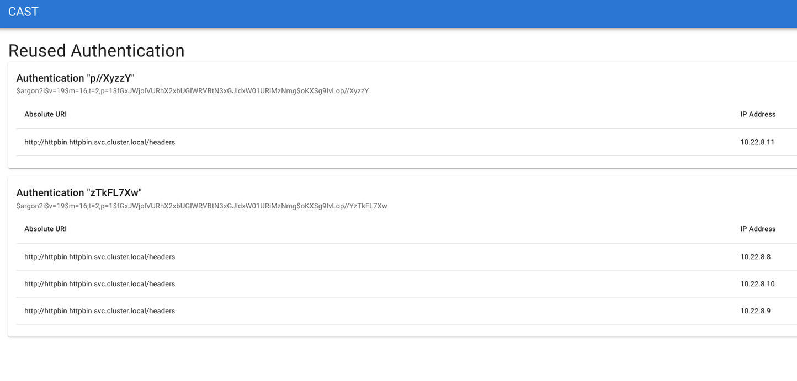

# CAST
[](https://codeclimate.com/github/corshatech/cast/test_coverage)

CAST is an API security tool being developed to evaluate Kubernetes API traffic for authentication
vulnerabilities such as reused credentials.

Deployed as a Helm package, CAST produces a web report of API vulnerabilities
and does not store or export any un-hashed cryptographic material.

<!-- START doctoc generated TOC please keep comment here to allow auto update -->
<!-- DON'T EDIT THIS SECTION, INSTEAD RE-RUN doctoc TO UPDATE -->
**Table of Contents**

- [Evaluated Security Concerns](#evaluated-security-concerns)
  - [Credential Reuse](#credential-reuse)
- [Prerequisites](#prerequisites)
- [Installation](#installation)
  - [Install Kubeshark](#install-kubeshark)
  - [Install CAST](#install-cast)
  - [Uninstalling the Chart](#uninstalling-the-chart)
- [CAST UI](#cast-ui)
  - [Connecting to the UI](#connecting-to-the-ui)
  - [Using the UI](#using-the-ui)
- [Helm Parameters](#helm-parameters)
- [Contributing](#contributing)
- [License](#license)

<!-- END doctoc generated TOC please keep comment here to allow auto update -->

## Evaluated Security Concerns
CAST is designed to evaluate security concerns revolving around API Communication and
Authentication. These security concerns are broken up and explained here.

### Credential Reuse
Today API Clients authenticate to API services using an authentication scheme involving
bearer credentials. These credentials are generally come in the form of static, multi-use secrets such as a username/password, bearer tokens,
and client PKI certificates. These largely static keys, tokens, and certs are vulnerable to credential theft because as long as you possess the credential, you can use it to gain access to API services.  The bearer model does not take into account how the credential was obtained, i.e. perhaps stolen, or pin access to only trusted clients.
This weakness requires that API credentials like these must be kept as safe as possible, not shared, regularly rotated, and always created with tight expiry windows. OWASP has recognized these Identification and Authentication Failures in their
Annual "Top 10" vulnerabilities, stating "Where possible, implement multi-factor authentication to
prevent automated credential stuffing, brute force, and stolen credential reuse attacks." - [OWASP Top 10](https://owasp.org/Top10/A07_2021-Identification_and_Authentication_Failures/).

Unfortunately, because of the growing API ecosystems across cloud and hybrid environments, the incredible, rapid adoption of Kubernetes, and the exciting race to automate, API credentials often have poor security hygiene. This provides an expansive and growing attack vector where adversaries can use this scale and hygiene to their advantage.

CAST is a tool to hopefully help you shine a light into the corners and crevices of kubernetes-based API credential usage whether your API clients and services are running in cloud, your own datacenters, or even on-premises.  It is designed to help you quickly identify poor API secrets hygiene, such as sharing the same key or token across multiple workloads.  

## Prerequisites

* Kubernetes 1.21+
* Helm 3.8+
* Docker 20.10+

## Installation
Installation of the CAST tool can be broken up into two sections:
- Installing Kubeshark on a Kubernetes stack
- Installing the CAST tooling that leverages Kubeshark's taps

### Install Kubeshark
Installation of Kubeshark is straightforward and can be found on their site here:
[Kubeshark Installation](https://docs.kubeshark.co/en/install)

After installation is complete, tap the Namespaces or Clusters you wish CAST to evaluate
```bash
kubeshark tap -n <YOUR_NAMESPACE>
```


### Install CAST
Cast images are hosted on Github's Container Registry. First, you must follow their very
simple documentation on how to log in:
[Authenticating to the Container Registry](https://docs.github.com/en/packages/working-with-a-github-packages-registry/working-with-the-container-registry#authenticating-to-the-container-registry)

The preferred method of installation is to provide the parameters from a values file.
To install the CAST chart with the release name "my-release":

```bash
helm repo add corshatech https://corshatech.github.io/cast
helm install my-release corshatech/cast
```

If you want to customize the helm chart, a YAML file that specifies the values for the parameters can be provided while installing the chart. Check the [Helm Parameters](#helm-parameters) section below for more information.

> :memo:
> If you are re-installing CAST in a previously used namespace, you will need to delete the `data-cast-postgresql-0` PVC in order to remove the cached postgres password from the previous CAST deployment.
>```bash
>kubectl delete pvc data-cast-postgresql-0 
>```
> This can be avoided by setting `postgresql.auth.password` as described in the [Helm Parameters](#helm-parameters) section.

### Uninstalling the Chart

To uninstall/delete the `my-release` deployment:

```bash
helm delete my-release
```

## CAST UI
The CAST UI is the "single pane of glass" view into what vulnerabilities CAST has found on your
system.  Navigate to the CAST UI to monitor any vulnerabilities found on your cluster since CAST
was installed.

### Connecting to the UI
The UI is automatically hosted with the cast UI.  To reach it, you will need to connect to the
pod.

First, get the name of the cast UI pod via:
```bash
kubectl get pods -n <YOUR_NAMESPACE>
```

Second, connect to the pod service via:
```bash
kubectl port-forward -n <YOUR_NAMESPACE> <CAST_POD_NAME> 3000:3000
```

The web UI is now visible on `localhost:3000` via your web browser.

### Using the UI
Now that the web UI is launched, we can begin seeing vulnerabilities. Here is an example of
Credential Reuse:




## Helm Parameters
When installing a chart, you may provide a yaml file that edits certain parameters.


| Name                                                       | Description                                                                                                                                                                           | Value |
| ---------------------------------------------------------- | ------------------------------------------------------------------------------------------------------------------------------------------------------------------------------------- | ----- |
| `global.imagePullSecrets`                                  | Global Docker registry secret names as an array                                                                                                                                       | `[]`  |
| `postgresql.auth.username`                                      | Postgres db username                                                                                                                                          | `""`  |
| `postgresql.auth.database`                                      | Postgres database name                                                                                                                                          | `""`  |
| `postgresql.auth.password`                                      | Postgres database password. If this is not set, a random password will be generated.                                                                                                                                    | `""`  |
| `collector.env.PGPORT`                                      | Which port postgres is using                                                                                                                                          | `""`  |
| `collector.env.WEBSOCKET_URL`                                      | The web socket Kubeshark has attached to                                                                                                                                          | `""`  |
| `collector.image.tag`                                      | The tag of the cast/collector image                                                                                                                                          | `""`  |
| `collector.image.repository`                                      | The repository of the cast/collector image                                                                                                                                          | `""`  |
| `ui.env.PGPORT`                                      | Which port postgres is using                                                                                                                                          | `""`  |
| `ui.image.tag`                                      |  The tag of the cast/ui image                                                                                                                                          | `""`  |
| `ui.image.repository`                                      | The repository of the cast/ui image                                                                                                                                          | `""`  |

Specify each parameter using the --set key=value[,key=value] argument to helm install. For example,

```bash
    helm install my-release --set ui.env.PGPORT=5432 corshatech/cast
```

The above command sets the PGPORT variable to 5432.

Alternatively, a YAML file that specifies the values for the parameters can be provided while installing the chart. For example,

```bash
    helm install my-release -f values.yaml corshatech/cast
```

## Contributing
Check [CONTRIBUTING.md](./CONTRIBUTING.md) for instructions on how to contribute.

If you have questions you would like to ask the developers,
or feedback you would like to provide,
feel free to create an issue on our issue tracker.

Additionally, if you have a feature you would like to suggest,
feel free to create an issue on our issue tracker.


## License
Licensed under the Apache License, Version 2.0 (the "License");
you may not use this file except in compliance with the License.
You may obtain a copy of the License at

> [http://www.apache.org/licenses/LICENSE-2.0](http://www.apache.org/licenses/LICENSE-2.0)

Unless required by applicable law or agreed to in writing, software
distributed under the License is distributed on an "AS IS" BASIS,
WITHOUT WARRANTIES OR CONDITIONS OF ANY KIND, either express or implied.
See the License for the specific language governing permissions and
limitations under the License.
